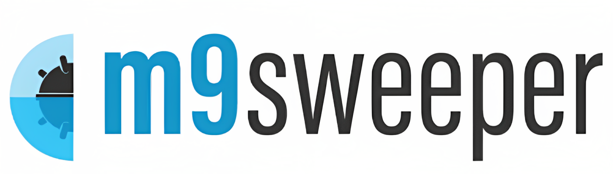
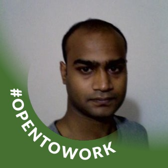

<!--
Hey, thanks for using the awesome-readme-template template.
If you have any enhancements, then fork this project and create a pull request
or just open an issue with the label "enhancement".

Don't forget to give this project a star for additional support ;)
Maybe you can mention me or this repo in the acknowledgements too
-->
<div align="center">

  
  <h1>m9sweeper</h1>

  <p>
    Kubernetes Security for Everyone!
  </p>

  <p>

</p>

<!-- Badges -->
<p>
  <a href="https://github.com/m9sweeper/m9sweeper/graphs/contributors">
    
  </a>
  <a href="">
    
  </a>
  <a href="https://github.com/m9sweeper/m9sweeper/network/members">
    
  </a>
  <a href="https://github.com/m9sweeper/m9sweeper/stargazers">
    
  </a>
  <a href="https://github.com/m9sweeper/m9sweeper/issues/">
    
  </a>

  <a href="https://github.com/m9sweeper/m9sweeper/blob/main/LICENSE">
    
  </a>
</p>

<h4>
    <a href="https://youtu.be/5sIqnYSZWAc/">View Demo</a>
  <span> · </span>
    <a href="https://m9sweeper.io/docs/latest/docs/">Documentation</a>
  <span> · </span>
    <a href="https://github.com/m9sweeper/m9sweeper/issues/">Report Bug</a>
  <span> · </span>
    <a href="https://github.com/m9sweeper/m9sweeper/issues/">Request Feature</a>
  </h4>
</div>

<br />

<!-- Table of Contents -->

# :notebook_with_decorative_cover: Table of Contents

- [About the Project](#star2-about-the-project)

  - [Features in Action](#camera-features-in-action)
  - [Features List](#dart-features)
  - [Prerequisites](#bangbang-prerequisites)
  - [Tool Box](#toolbox-toolbox)
  - [Quick Install](#gear-installation)
  - [Code of Conduct](#scroll-code-of-conduct)

- [Contributors](#wave-contributing)
- [License](#warning-license)
- [Contact](#handshake-contact)

<!-- About the Project -->

## :star2: About the Project

m9sweeper is a free and easy kubernetes security platform. It integrates industry standard open source utilities into a one-stop-shop kubernetes security tool that can walk most kubernetes adminstrators through securing a kubernetes cluster as well as the apps running on the cluster.

<!-- Screenshots -->

### :camera: Features in Action

<div align="center">
  
</div>

<!-- Features -->

### :dart: Features

m9sweeper makes securing a cluster easy with:

- CVE Scanning
- Enforcement of CVE Scanning Rules
- Reports and Dashboards, including historical reporting to see how your security posture has changed over time
- CIS Security Benchmarking
- Pen Testing
- Deployment Coaching
- Intrusion Detection
- Gatekeeper Policy Management

<!-- Getting Started -->

## :toolbox: Toolbox

m9sweeper makes it easy to orchestrate the implementation of a number of free security tools:

[Trivy](https://github.com/aquasecurity/trivy): CVE Scanner

[Kubesec](https://github.com/controlplaneio/kubesec): Deployment Best Practices

[kube-bench](https://github.com/aquasecurity/kube-bench): CIS Benchmarks

[OPA Gatekeeper](https://github.com/open-policy-agent/gatekeeper): Compliance and Security Policies

[kube-hunter](https://github.com/aquasecurity/kube-hunter): Cluster Penetration Testing

[Project Falco](https://falco.org/): Intrusion Detection

<!-- Prerequisites -->

### :bangbang: Prerequisites

This project requires a Kubernetes Cluster and uses helm as package manager

```bash
Installing Kubernetes Locally with Minikube
Mac: Install from terminal
curl -LO https://storage.googleapis.com/minikube/releases/latest/minikube-darwin-amd64
sudo install minikube-darwin-amd64 /usr/local/bin/minikube

Windows: Install with chocolatey and install a bash client
choco install minikube
choco install git

Both: Start Kubernetes
minikube start --cni calico --kubernetes-version=v1.23.16
kubectl get pods --all-namespaces

More at  https://minikube.sigs.k8s.io/docs/start/

```

<!-- Installation -->

### :gear: Quick Installation

While our documentation has more details, installing m9sweeper can be as simple
as running a few CLI commands to install it into your own kubernetes cluster
with helm.

    helm repo add m9sweeper https://m9sweeper.github.io/m9sweeper && \
    helm repo update && \
    helm upgrade m9sweeper m9sweeper/m9sweeper --install --wait \
      --create-namespace --namespace m9sweeper-system \
      --set-string dash.init.superAdminEmail="super.admin@m9sweeper.io" \
      --set-string dash.init.superAdminPassword="password" \
      --set-string global.jwtSecret="changeme" \
      --set-string global.apiKey="YOUR-API-KEY"

<!-- Contributing -->

## :wave: Contributing

<a href="https://github.com/vellankikoti/awesome-readme-template/graphs/contributors">
  
</a>

The initial project was created by team members at Intelletive Consulting at times when projects were slow or to train new members, but we hope others will contribute as well. Thanks goes to these wonderful people ([emoji key](https://allcontributors.org/docs/en/emoji-key)):

<!-- ALL-CONTRIBUTORS-LIST:START - Do not remove or modify this section -->
<!-- prettier-ignore-start -->
<!-- markdownlint-disable -->
<table>
  <tbody>
    <tr>
      <td align="center" valign="top" width="14.28%"><a href="https://github.com/jacobbeasley"><br /><sub><b>Jacob Beasley</b></sub></a><br /><a href="https://github.com/m9sweeper/m9sweeper/commits?author=jacobbeasley" title="Code">💻</a> <a href="https://github.com/m9sweeper/m9sweeper/commits?author=jacobbeasley" title="Documentation">📖</a> <a href="#research-jacobbeasley" title="Research">🔬</a> <a href="#projectManagement-jacobbeasley" title="Project Management">📆</a> <a href="#infra-jacobbeasley" title="Infrastructure (Hosting, Build-Tools, etc)">🚇</a></td>
      <td align="center" valign="top" width="14.28%"><a href="https://www.linkedin.com/in/jason-woodman-8604476/"><br /><sub><b>jasonWoodman</b></sub></a><br /><a href="https://github.com/m9sweeper/m9sweeper/commits?author=jasonWoodman" title="Code">💻</a> <a href="https://github.com/m9sweeper/m9sweeper/commits?author=jasonWoodman" title="Documentation">📖</a> <a href="#research-jasonWoodman" title="Research">🔬</a> <a href="#projectManagement-jasonWoodman" title="Project Management">📆</a> <a href="#infra-jasonWoodman" title="Infrastructure (Hosting, Build-Tools, etc)">🚇</a></td>
      <td align="center" valign="top" width="14.28%"><a href="https://github.com/brandan-schmitz"><br /><sub><b>Brandan Schmitz</b></sub></a><br /><a href="https://github.com/m9sweeper/m9sweeper/commits?author=brandan-schmitz" title="Code">💻</a> <a href="#infra-brandan-schmitz" title="Infrastructure (Hosting, Build-Tools, etc)">🚇</a> <a href="https://github.com/m9sweeper/m9sweeper/commits?author=brandan-schmitz" title="Documentation">📖</a></td>
      <td align="center" valign="top" width="14.28%"><a href="https://github.com/KBerndt10"><br /><sub><b>KBerndt10</b></sub></a><br /><a href="https://github.com/m9sweeper/m9sweeper/commits?author=KBerndt10" title="Code">💻</a> <a href="#infra-KBerndt10" title="Infrastructure (Hosting, Build-Tools, etc)">🚇</a></td>
      <td align="center" valign="top" width="14.28%"><a href="https://www.linkedin.com/in/becky-saunders/"><br /><sub><b>beckysaunders94</b></sub></a><br /><a href="https://github.com/m9sweeper/m9sweeper/commits?author=beckysaunders94" title="Code">💻</a></td>
      <td align="center" valign="top" width="14.28%"><a href="https://github.com/sunny1304int"><br /><sub><b>Farhan Tanvir</b></sub></a><br /><a href="https://github.com/m9sweeper/m9sweeper/commits?author=sunny1304int" title="Code">💻</a></td>
      <td align="center" valign="top" width="14.28%"><a href="https://github.com/jshoberg"><br /><sub><b>jshoberg</b></sub></a><br /><a href="https://github.com/m9sweeper/m9sweeper/commits?author=jshoberg" title="Code">💻</a></td>
    </tr>
    <tr>
      <td align="center" valign="top" width="14.28%"><a href="https://github.com/charisprose"><br /><sub><b>charisprose</b></sub></a><br /><a href="https://github.com/m9sweeper/m9sweeper/commits?author=charisprose" title="Code">💻</a> <a href="https://github.com/m9sweeper/m9sweeper/commits?author=charisprose" title="Tests">⚠️</a></td>
      <td align="center" valign="top" width="14.28%"><a href="http://www.tariquemahmud.net/"><br /><sub><b>Gazi Tarique Mahmud</b></sub></a><br /><a href="https://github.com/m9sweeper/m9sweeper/commits?author=tarique313" title="Code">💻</a></td>
      <td align="center" valign="top" width="14.28%"><a href="http://www.intelletive-bd.com/"><br /><sub><b>Shibly</b></sub></a><br /><a href="https://github.com/m9sweeper/m9sweeper/commits?author=sforkani" title="Code">💻</a></td>
      <td align="center" valign="top" width="14.28%"><a href="https://github.com/sabbirali"><br /><sub><b>sabbirali</b></sub></a><br /><a href="https://github.com/m9sweeper/m9sweeper/commits?author=sabbirali" title="Code">💻</a></td>
      <td align="center" valign="top" width="14.28%"><a href="https://github.com/GrantWK"><br /><sub><b>Grant Keiner</b></sub></a><br /><a href="https://github.com/m9sweeper/m9sweeper/commits?author=GrantWK" title="Code">💻</a></td>
      <td align="center" valign="top" width="14.28%"><a href="https://github.com/grantoenges"><br /><sub><b>grantoenges</b></sub></a><br /><a href="https://github.com/m9sweeper/m9sweeper/commits?author=grantoenges" title="Code">💻</a></td>
      <td align="center" valign="top" width="14.28%"><a href="https://www.linkedin.com/in/maggie-tian-cs/"><br /><sub><b>Maggie Tian</b></sub><br /><a href="https://www.linkedin.com/in/maggie-tian-cs" title="Code">💻</a></td>
    </tr>
    <tr>
      <td align="center" valign="top" width="14.28%"><br /><sub><b>Rakibul Rushel</b></sub><br /><a href="https://github.com/m9sweeper/m9sweeper/commits?author=" title="Code">💻</a></td>
      <td align="center" valign="top" width="14.28%"><br /><sub><b>Jobayer Ahmed</b></sub><br /><a href="https://github.com/m9sweeper/m9sweeper/commits?author=" title="Code">💻</a></td>
      <td align="center" valign="top" width="14.28%"><br /><sub><b>Steve Gagnon</b></sub><br /><a href="https://github.com/m9sweeper/m9sweeper/commits?author=" title="Code">💻</a></td>
      <td align="center" valign="top" width="14.28%"><a href="https://www.linkedin.com/in/abm-khorshed-alam-rifat-a9945b126"><br /><sub><b>Khorshed Alam</b></sub><br /><a href="https://www.linkedin.com/in/abm-khorshed-alam-rifat-a9945b126/" title="Code">💻</a></td>
      <td align="center" valign="top" width="14.28%"><a href="https://www.linkedin.com/in/vellankikoti/"></a><br /><sub><b>Koti Vellanki</b></sub><br /><a href="https://www.linkedin.com/in/vellankikoti/" title="Code">💻</a></td>
      <td align="center" valign="top" width="14.28%"><a href="https://www.linkedin.com/in/sahil-narang-bab6a2135/"><br /><sub><b>Sahil Narang</b></sub><br /><a href="https://github.com/m9sweeper/m9sweeper/commits?author=" title="Code">💻</a> <a href="#infra" title="Infrastructure (Hosting, Build-Tools, etc)">🚇</a></td>
      <td align="center" valign="top" width="14.28%"><a href="https://www.linkedin.com/in/shahriyasiddique/"><br /><sub><b>Shahriya Siddique</b></sub><br /><a href="https://github.com/m9sweeper/m9sweeper/commits?author=" title="Code">💻</a></td>
    </tr>
    <tr>
      <td align="center" valign="top" width="14.28%"><a href="https://www.linkedin.com/in/rrprodhan/"><br /><sub><b>Raiyan Prodhan</b></sub><br /><a href="https://github.com/m9sweeper/m9sweeper/commits?author=" title="Code">💻</a></td>
      <td align="center" valign="top" width="14.28%"><a href="https://www.linkedin.com/in/kristin-sandness/"><br /><sub><b>Kristin Sandness</b></sub><br /><a href="https://github.com/m9sweeper/m9sweeper/commits?author=" title="Code">💻</a></td>
      <td align="center" valign="top" width="14.28%"><a href="https://www.linkedin.com/in/samer-chandra-sarker-khokon-a2191b59/"><br /><sub><b>Samer Sarker</b></sub><br /><a href="https://github.com/m9sweeper/m9sweeper/commits?author=" title="Code">💻</a></td>
    </tr>
  </tbody>
</table>

<!-- markdownlint-restore -->
<!-- prettier-ignore-end -->

<!-- ALL-CONTRIBUTORS-LIST:END -->

This project follows the [all-contributors](https://github.com/all-contributors/all-contributors) specification. Contributions of any kind welcome!

<!-- Feature Requests -->

## Feature Requests

If you have feature requests, please submit them as github issues and prefix the request with "Feature Request:". If you find the feature has already been requested, then please upvote that feature so we know it is a feature that others are looking for.

This helps us to prioritize further feature development based upon the needs of our users.

<!-- License -->

## :warning: License

Distributed under the Apache License v2. See LICENSE.txt for more information.

<!-- Contact -->

## :handshake: Contact

Official website - [@official_website](https://m9sweeper.io/)

Project Link: [https://github.com/m9sweeper/m9sweeper](https://github.com/m9sweeper/m9sweeper)
