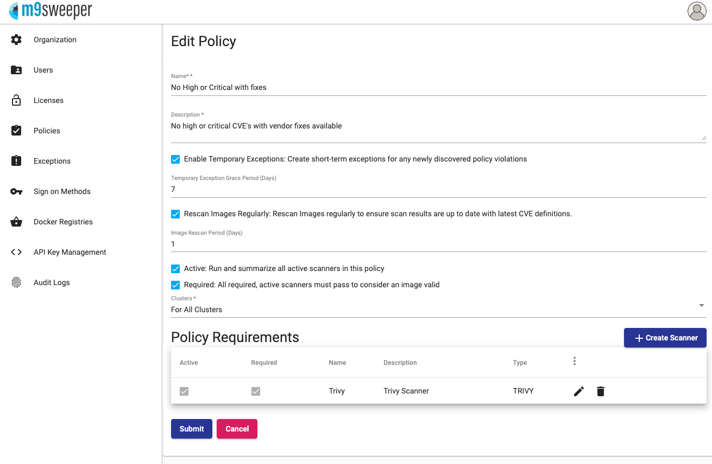

To enable enforcement, you need to make your way to the Cluster settings for your cluster and check the box that 
enables webhook enforcement. 

Once checked, anything that is not compliant with the policies you have setup will be prevented from deploying. Note
that this only works if you have installed the webhook during the setup process. 

