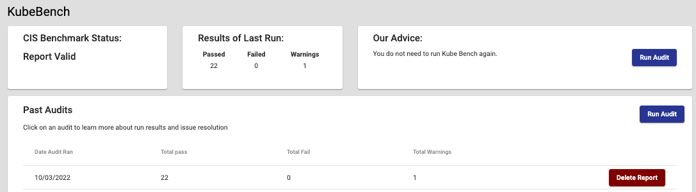
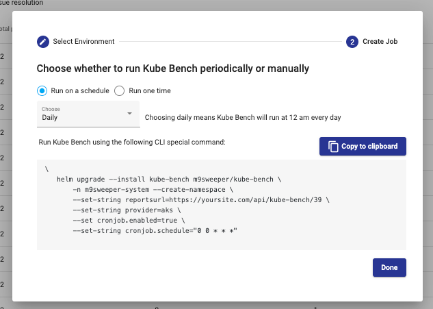
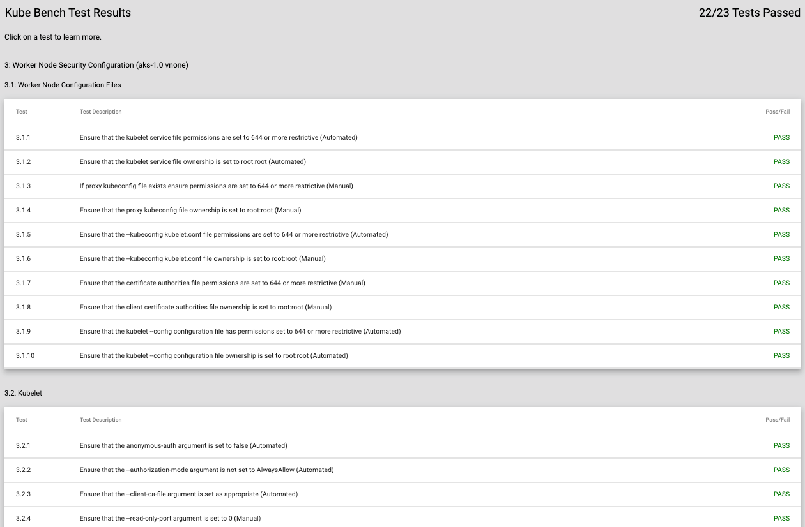
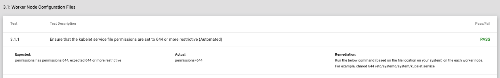

kube-bench will run a scan of your cluster to compare its configuration against the Center for Internet Security (CIS)
benchmarks. This is a good way to check for obvious configuration issues, such as allowing anonymous users. It deploys as an
application in your cluster and then accesses the Kubernetes APIs to see how your cluster is configured. 

We recommend setting up kube-bench to run as a nightly cron job so that you can see the effect of any changes you
make to your cluster.

First, you need to install kube-bench and set it up to upload its results to m9sweeper. To do this, go to kube-bench
for your cluster and click on Run Audit in the top right.

Then, you can use the wizard to generate a CLI command that will install kube-bench using our helm chart as a cron job
or one-time job in your cluster. It will upload its results back to the API (and you should see an API key in the url).

Note that this will only work IF you have enabled traffic ingressing or otherwise allowed kube-bench to pipe its
results back to the m9sweeper dash app.

And then this will display a summary report, like this:

You can click on any line to expand it and see directions for remediation. 

