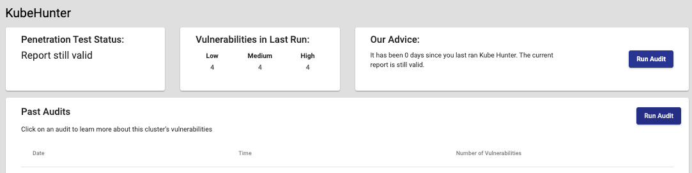
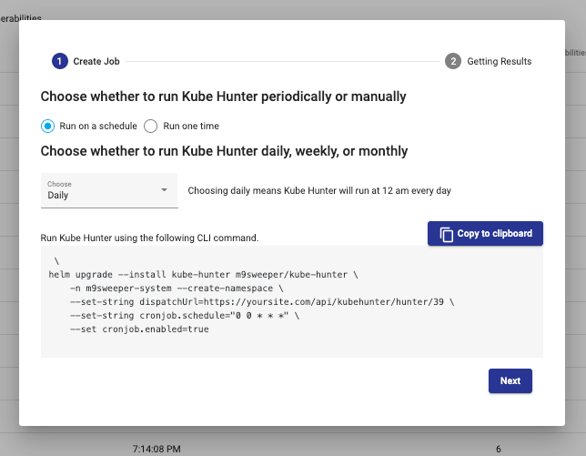
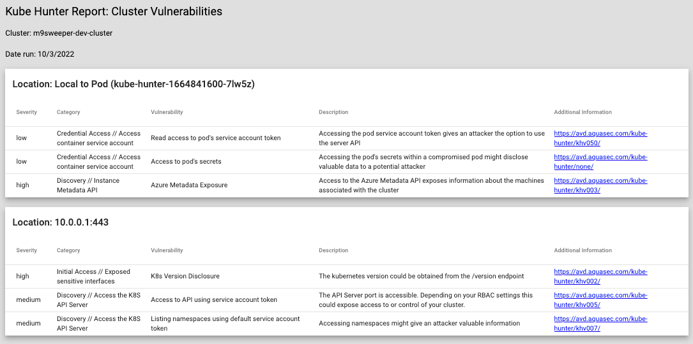

kube-hunter will run a non-invasive (or invasive, if you want) penetration test of your cluster. It deploys as an 
application in your cluster and then attempts to explore and see what all it is able to do. It reports back on any
concerns that you should be aware of. 

We recommend setting up kube-hunter to run as a nightly cron job so that you can see the effect of any changes you 
make to your cluster. 

First, you need to install kube-hunter and set it up to upload its results to m9sweeper. To do this, go to kube-hunter
for your cluster and click on Run Audit in the top right. 

Then, you can use the wizard to generate a CLI command that will install kube-hunter using our helm chart as a cron job
or one-time job in your cluster. It will upload its results back to the API (and you should see an API key in the url).

Note that this will only work IF you have enabled traffic ingressing or otherwise allowed kube-hunter to pipe its 
results back to the m9sweeper dash app. 

And then this will display a summary report, like this: 

