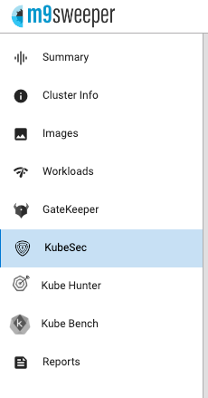
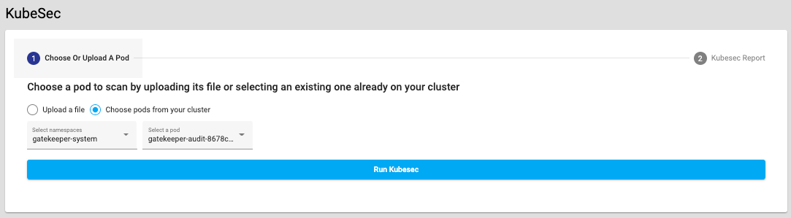
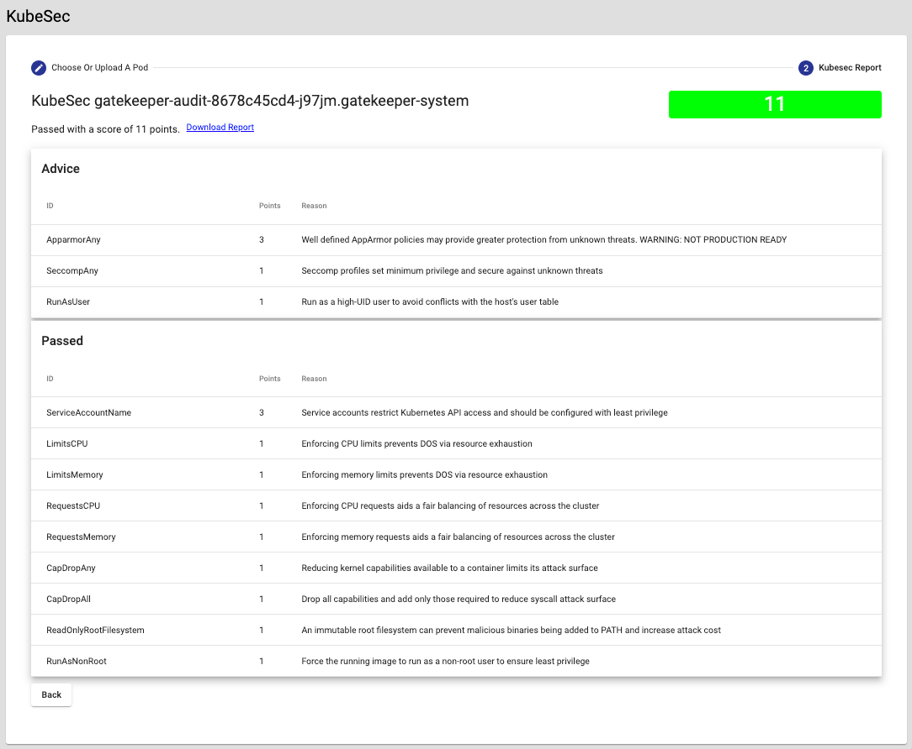

KubeSec coaches you about how to make your deployments more secure. You can find it in the left navigation after
selecting a cluster. 

To get started, select a pod you want to evaluation and click Run KubeSec. 

It will then display a report of your pods' compliance and any improvements that could be made. 

