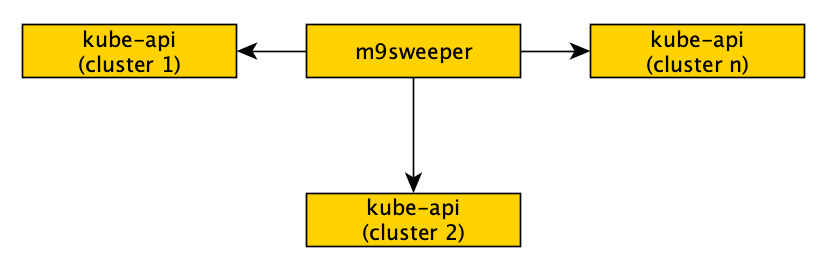

M9sweeper deploys as an app in your Kubernetes cluster. We like to say that is Kubernetes-native; that is to say, 
you can deploy it entirely inside of kubernetes. You do not need to install complicated applications in your Kubernetes
nodes. This makes it very safe and easy to install. 

It also can be installed in a hub-and-spoke way, with a single m9sweeper install monitoring multiple kubernetes 
clusters. This requires that you ingress traffic to m9sweeper, and is preferred if you have a lot of kubernetes clusters. 

**There are 2 ways to get started:**

 - [Easy Install Guide](easy-install/) - If you do not want a step-by-step wizard but still want to get it booted up with largely the defaults, start here.
 - [Advanced Install Guide](advanced-install/) - This covers all the options short of reviewing the reference materials. 
